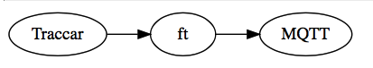

# ft

_ft_ is _from Traccar_. It listens on the loopback interface and obtains positions and events from Traccar via HTTP POST, extracts the JSON payload from the body, and publishes it via MQTT.



The topic branch is contructed from the device _uniqueId_ and `position` or `event/<eventType>`

## usage

```bash
export FT_USER=mqttusername
export FT_PASS=mqttpass
export FT_IP=127.0.0.1 #default  Bind address
export FT_PORT=8840 #default     Bind port
export FT_MQTT_HOST=127.0.0.1 #default
export FT_MQTT_PORT=1883 #default
```

Invoke with option `-c` to force incoming HTTP connections to close; default is false, i.e. the connection remains open.

### metrics

```
fromtraccar.requests.incoming:1|c		counter for incoming HTTP requests total
fromtraccar.requests.incoming.size:1202|g	size of incoming payload
fromtraccar.requests.position:1|c		counter if request is a position query
fromtraccar.requests.event:1|c			counter if request is an event query
fromtraccar.event.ignitionOff:1|c		counter for type of event
fromtraccar.requests.tomqtt:1|c			counter for sent off to MQTT
```

### stats

```console
$ curl http://localhost:8840/stats
{
  "stats": {
    "_whoami": "ft.c",
    "stats": 1322,
    "requests": 292113,
    "positions": 280658,
    "events": 11455
  },
  "uptime": 1187319,
  "uptime_s": "13 days, 17:48",
  "tst": 1629206990,
  "force_close" : false
}
```


## topics

```
_traccar/q54/position
_traccar/q54/event/geofenceExit
_traccar/q54/event/ignitionOff
```

## payloads

```json
{
	"event": {
		"id": 1187,
		"attributes": {},
		"deviceId": 7,
		"type": "deviceOnline",
		"serverTime": "2018-09-14T10:18:32.285+0000",
		"positionId": 0,
		"geofenceId": 0,
		"maintenanceId": 0
	},
	"device": {
		"id": 7,
		"attributes": {
			"aaa": "AAAA",
			"bbb": "BBBB",
			"ccc": "CCCC"
		},
		"groupId": 0,
		"name": "Demo-54",
		"uniqueId": "q54",
		"status": "online",
		"lastUpdate": "2018-09-14T10:18:32.285+0000",
		"positionId": 18321,
		"geofenceIds": [
			7
		],
		"phone": "0171",
		"model": "dkdkk",
		"contact": "contcact",
		"category": "boat",
		"disabled": false
	},
	"users": [
		{
			"id": 1,
			"attributes": {
				"pushover.user": "a22200",
				"pushover,token": "aabbbt0009"
			},
			"name": "admin",
			"login": "",
			"email": "admin",
			"phone": "+491234567890",
			"readonly": false,
			"administrator": true,
			"map": "",
			"latitude": 0,
			"longitude": 0,
			"zoom": 3,
			"twelveHourFormat": false,
			"coordinateFormat": "",
			"disabled": false,
			"expirationTime": null,
			"deviceLimit": -1,
			"userLimit": 0,
			"deviceReadonly": false,
			"token": null,
			"limitCommands": false,
			"poiLayer": "",
			"password": null
		}
	]
}
{
	"position": {
		"id": 18322,
		"attributes": {
			"t": "I",
			"ignition": false,
			"distance": 449672.22,
			"totalDistance": 29561830.63,
			"motion": false,
			"hours": 55000
		},
		"deviceId": 7,
		"type": null,
		"protocol": "owntracks",
		"serverTime": null,
		"deviceTime": "2018-09-14T10:18:32.000+0000",
		"fixTime": "2018-09-14T10:18:32.000+0000",
		"outdated": false,
		"valid": true,
		"latitude": 48.83875,
		"longitude": 2.25353,
		"altitude": 0,
		"speed": 0,
		"course": 0,
		"address": null,
		"accuracy": 0,
		"network": null
	},
	"device": {
		"id": 7,
		"attributes": {
			"aaa": "AAAA",
			"bbb": "BBBB",
			"ccc": "CCCC"
		},
		"groupId": 0,
		"name": "Demo-54",
		"uniqueId": "q54",
		"status": "online",
		"lastUpdate": "2018-09-14T10:18:32.285+0000",
		"positionId": 18321,
		"geofenceIds": [],
		"phone": "0171",
		"model": "dkdkk",
		"contact": "contcact",
		"category": "boat",
		"disabled": false
	}
}
{
	"geofence": {
		"id": 7,
		"attributes": {},
		"calendarId": 0,
		"name": "blub9",
		"description": "",
		"area": "CIRCLE (49.133867934876974 8.166520803303387, 33112.6)"
	},
	"position": {
		"id": 18322,
		"attributes": {
			"t": "I",
			"ignition": false,
			"distance": 449672.22,
			"totalDistance": 29561830.63,
			"motion": false,
			"hours": 55000
		},
		"deviceId": 7,
		"type": null,
		"protocol": "owntracks",
		"serverTime": null,
		"deviceTime": "2018-09-14T10:18:32.000+0000",
		"fixTime": "2018-09-14T10:18:32.000+0000",
		"outdated": false,
		"valid": true,
		"latitude": 48.83875,
		"longitude": 2.25353,
		"altitude": 0,
		"speed": 0,
		"course": 0,
		"address": null,
		"accuracy": 0,
		"network": null
	},
	"event": {
		"id": 1188,
		"attributes": {},
		"deviceId": 7,
		"type": "geofenceExit",
		"serverTime": "2018-09-14T10:18:32.316+0000",
		"positionId": 18322,
		"geofenceId": 7,
		"maintenanceId": 0
	},
	"device": {
		"id": 7,
		"attributes": {
			"aaa": "AAAA",
			"bbb": "BBBB",
			"ccc": "CCCC"
		},
		"groupId": 0,
		"name": "Demo-54",
		"uniqueId": "q54",
		"status": "online",
		"lastUpdate": "2018-09-14T10:18:32.285+0000",
		"positionId": 18321,
		"geofenceIds": [],
		"phone": "0171",
		"model": "dkdkk",
		"contact": "contcact",
		"category": "boat",
		"disabled": false
	},
	"users": [
		{
			"id": 1,
			"attributes": {
				"pushover.user": "a22200",
				"pushover,token": "aabbbt0009"
			},
			"name": "admin",
			"login": "",
			"email": "admin",
			"phone": "+491234567890",
			"readonly": false,
			"administrator": true,
			"map": "",
			"latitude": 0,
			"longitude": 0,
			"zoom": 3,
			"twelveHourFormat": false,
			"coordinateFormat": "",
			"disabled": false,
			"expirationTime": null,
			"deviceLimit": -1,
			"userLimit": 0,
			"deviceReadonly": false,
			"token": null,
			"limitCommands": false,
			"poiLayer": "",
			"password": null
		}
	]
}
```

## before / after

### before

```
< HTTP/1.1 200 OK
< Server: Mongoose/6.12
< Content-Type: text/plain
< Connection: keep-alive
< Content-Length: 0
<
* Connection #0 to host 127.0.0.1 left intact
```

### after

```
< HTTP/1.1 200 OK
< Connection: Keep-Alive
< Content-Length: 0
< Content-Type: text/plain
< Date: Mon, 24 Sep 2018 07:03:10 GMT
<
* Connection #0 to host 127.0.0.1 left intact
```

## requirements

* [libmicrohttpd](https://www.gnu.org/software/libmicrohttpd/)
* [statsd-c-client](https://github.com/romanbsd/statsd-c-client)
* [utstring](https://troydhanson.github.io/uthash/utstring.html)

